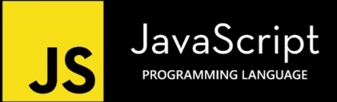

# JavaScript or JS
### is one of the most popular language. Usually it is used for making web-pages.

# If HTML was noun, CSS an adjective, JS is verb.

### Because with JS we can give to our website an action.

# By whom JS has been created?
### Brendan Eich has created JS and the name of it was Mocha. In that times Java was the most popular programming languages so to attract Java users to his own programming language he named it to JAVAscript.

# What is ES?
### EcmaScript or ES is a scriptng language 